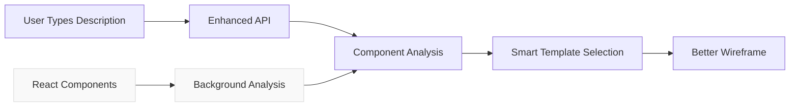

# 🧹 Interface Cleanup: Why React Components Section Was Removed

## ❓ The Problem

You were absolutely right to question the empty React Components section! Here's why it was unnecessary:

## 🔍 Root Cause Analysis

### 1. **Technical Mismatch**

- **React Components** = `.tsx` files with JSX, props, state, TypeScript
- **Component Library Modal** = Ready-to-use HTML/CSS snippets
- **The Gap**: You can't directly insert React source code into HTML wireframes

### 2. **User Experience Issues**

- **Empty Section**: The React components weren't usable as HTML snippets
- **Confusing Interface**: Users expected ready-to-use components, not source code
- **Redundant**: The real benefit happens behind the scenes during wireframe generation

### 3. **Better Architecture**

The **real value** of component detection is:

- ✅ **Behind-the-scenes intelligence**: Enhanced wireframe generation uses component knowledge
- ✅ **Smarter AI**: Knows about your component patterns and naming conventions
- ✅ **Better templates**: Automatically selects appropriate layouts based on detected components
- ❌ **NOT**: Manual component selection in a library modal

## 🛠️ What We Fixed

### ✅ **Removed Unnecessary UI Elements**

- Removed "React Components" tab from Component Library Modal
- Removed "Fluent UI" mode selector (enhancement happens automatically)
- Simplified interface back to FluentUI and Atlas libraries

### ✅ **Kept the Real Value**

- ✅ Enhanced wireframe generation still uses your React component knowledge
- ✅ Backend still detects and analyzes 62 React components
- ✅ AI still gets smarter based on your component patterns
- ✅ Wireframes still benefit from component-driven intelligence

### ✅ **Improved User Experience**

- Cleaner, less confusing interface
- No empty sections
- Focus on actually useful component libraries (FluentUI/Atlas)

## 🎯 How Component Intelligence Actually Works

**The component intelligence works invisibly:**

1. Your 62 React components are analyzed in the background
2. AI learns your naming conventions, patterns, and component types
3. When generating wireframes, it selects better templates and structures
4. Result: More realistic wireframes that match your actual architecture

## 💡 The Right Way to Think About It

| ❌ Wrong Approach          | ✅ Right Approach                     |
| -------------------------- | ------------------------------------- |
| Manual component selection | Automatic component intelligence      |
| Expose React source code   | Use component knowledge behind scenes |
| Add UI complexity          | Keep interface clean and focused      |
| Show technical details     | Show user value                       |

## 🎉 Final Result

**What Users See:**

- Clean, focused component library with FluentUI and Atlas
- Enhanced wireframe generation that "just works better"
- No confusing empty sections

**What Happens Behind the Scenes:**

- Your 62 React components inform smarter wireframe generation
- AI understands your component architecture
- Better templates and layouts are automatically selected

**Best of Both Worlds:**

- Simple, clean user interface
- Powerful component-driven intelligence working invisibly
- Enhanced results without complexity

The cleanup makes the interface much better while keeping all the intelligent benefits of component detection! 🎨✨
